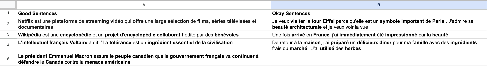

# cognate_sentences
Consider the following French sentence:
> “Le président Emmanuel Macron assure le peuple canadien que le gouvernement français va continuer à défendre le Canada contre la menace américain.”

Any English speaker can make sense of this even if they don't know any French. My goal with this project is to generate these sorts of sentences automatically. Furthermore, I provide a [gamified interface](app.vkethana.com) where the user can attempt to translate the provided sentences and receive feedback in near real time.
Currently, I'm using GPT-3.5-Turbo along with a heuristic function and beam search to filter for sentences that are both grammatically correct and have a high "interpretability" score.
## How the interpretability heuristic works
It takes into account:
- *cognate_ratio*: The ratio of cognates to total words in a sentence. Any sentence with a low cognate ratio (< 0.20) is automatically given a score of 0.
- *avg_gap_between_consecutive_cognates*: The average length of each gap between clusters of cognates. A "gap" is defined as a stretch two or more consecutive non-cognate words. In a good sentence, the gaps are short, and ideally the largest gap is no more than 3 or 4 words:

- *biggest_gap*: Any sentence whose largest gap is larger than 5 words is automatically given a score of 0. (If an English speaker sees 5 words in a row that they don't understand, they may give up.)
- *avg_non_cognate_length*: Sentences are penalized for having non-cognate words which are too long.
- *total_score*: A combination of the above factors
You can check it out for yourself in the `openai_beam_search.py` file under the `get_score_breakdown`	function.

## How cognates are identified
1) Take a given French word, e.g. "augmentation"
2) Translate it into English. In this example, "augmenter" = "increase"
3) Do the translation and the original word have a low edit ratio (i.e. lots of characters in common)? Then the word is cognate.
4) Otherwise, try iterating through the synonyms of the English word to see if there's a match. For example, French "augmentation" has few characters in common with English "increase", but if we look through words related to "increase" using WordNet then "augmentation" is likely to be found somewhere in there. (This part is still a little buggy.)
5) If neither of these conditions is met then the word is not considered a cognate.

## What all the files do
- `production_data/fr_en_dict.json`: Contains a few thousand French words and their English translation. Speeds up the cognate identification process by several times since commonly used words don't have to be run through Google Translate (which takes at >= 0.5 sec / word)
- `app.py`: The web app, which you can try out for yourself at [app.vkethana.com](app.vkethana.com)
- `gui_free_testing.py`: Used for testing the heuristic function with manually inputted examples
- `openai_beam_search.py`:  **This is the most important file in the list.** 
Used for testing the heuristic function with GPT-generated inputted examples. 
It also has the cognate identification function, some sentence-starters for the model, and specifies some of the parameters for how the model is invoked. 
When run, it outputs beam search results to a CSV file in `data/`. 
Useful for debugging the scoring function and for collecting a dataset to be used for fine-tuning. 
The GPT-3.5 calls involve asking the model to extend an already-existing sentence by around 5 words using the v1 completions endpoint, which outputs 4 choices from which we choose 3. At no point does the model generate a sentence totally from scratch, it always has least one word as a starter. If `use_seed_words` is enabled then the model will also have 2 cognates as starter words
- `utils.py`: Contains the `node` class, which is a wrapper around sentences that allows for easy comparison and storing of scoring information. Handles the calls to NLTK, WordNet, Google Translate, and the edit distance function.

## Known bugs
### Unexplained Underscores 
If the use_seed_words setting is enabled in `openai_beam_search.py`, occaisionally GPT-3.5 will output underscores in place of the actual seed word. Also, it may make grammatical errors. For example, consider the following prompt:
```
You are about to receive a sentence in French. 
Please complete the sentence in that language as coherently as possible. 
Please include at least one of the following words in your response: abondantes., caractérisé. 
You may include additional sentences afterward. 
Please try to generate human-like text. 
Above all, please do not write sentences in English (loanwords OK). 
Avoid including random underscores in your response. 
The sentence is:

La
```
One incorrect output for this prompt that exhibits the bug is the following:
```
La forêt amazonienne est __________ par sa biodiversité abondantes. Les
```
Interestingly, if we replace the underscores with the provided seed word "caractérisé", the sentence makes sense. "The amazon forest is characterized by its abundants [sic] biodiversity." 

### Grammar errors
The model appears to make grammatical errors in some cases. For example, the incorrect plural adjective in "biodiversité abondantes" (it should be abondante) 

### Zero-length sentences
Sometimes we get outputs of zero length. This is a problem when there are lines of code like
```python
cognate_ratio = len(cognates) / len(words)
```
because it causes division by zero. Some checks have been implemented to prevent this but it still happens sometimes.

## Future work
- Fine-tune GPT-3.5 on a subset of examples with high scores (done)
- Find a way to compare the fine-tuned model with the original model. Can we prove that the fine-tuned model outputs more cognateful sentences?
- How do we prove that the fine-tuned model is not simply overfitting?
- How can we generate sentence-staters programmatically instead of grabbing from a predetermined list?
- How can we choose cognate "seed words" for a sentence without causing hallucinations (see above)? Also, how can we choose the cognate words programmatically instead of selecting from a predetermined list of cognates?
- Would RL help with this project?
